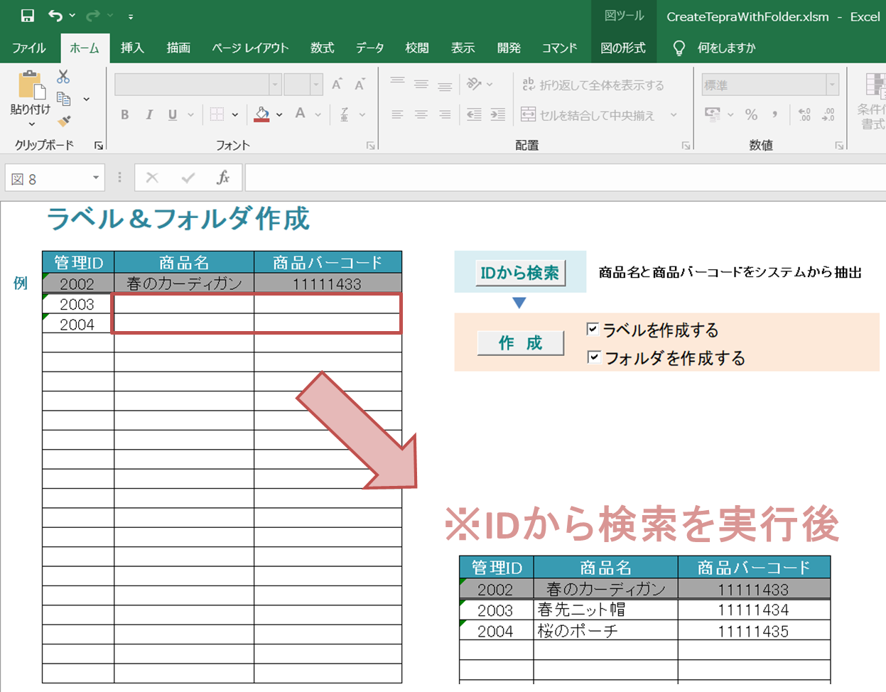

# テプラ印刷＆WEBスクレイピングツール
　

## 概要
- 管理IDから商品名・商品バーコードをスクレイピングで取得します。
- テプラ印刷とともに新しいフォルダも生成します。
- 繰り返し入力作業を削減し、管理IDの入力だけで完結します。
- 手入力によるヒューマンエラーをなくします。

## 主な機能
- sendkeyメソッドでスクレイピング
- 新しいフォルダを作成
- TepraAPIでTepraソフトと連携
